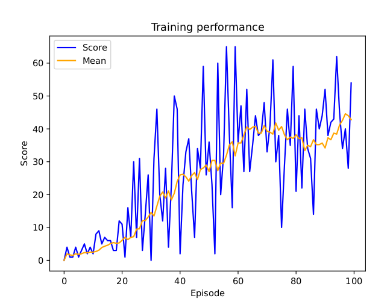
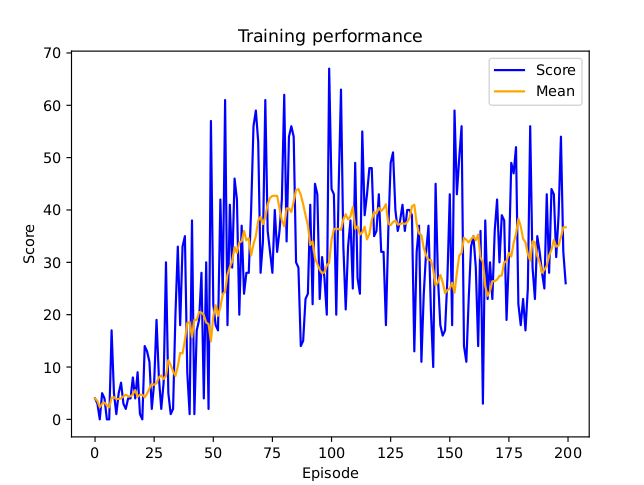

# Snake RL

This project implements a reinforcement learning (RL) framework to train an agent to play the classic Snake game. It focuses on comparing two popular RL algorithms—Deep Q-Learning (DQN) and Double Deep Q-Learning (DDQN)—by training the agents using neural networks and analyzing their performance. The project also includes visualization of the agent's training process and performance, as well as the integration of a human player for comparison.

## Project requirements

The main objectives of this project were:

- Implement an environment that can be interacted with by multiple agents.
- Develop Deep Q-Learning and Double Deep Q-Learning agents.
- Integrate a human player interface to interact with the environment.
- Visualize the agent's training process and gameplay using Pygame and Pyplot.
- Compare the performance of DDQN and DQN agents.
- Investigate the impact of state dimensions on the agent's performance.

## Setup the project on your local machine

1. Clone the repo: `git clone https://github.com/Ironmomo/`
2. Create a virtual environment: `python -m venv venv`
3. Activate the virtual environment: `source venv/bin/activate`
4. Install dependencies: `pip install -r requirements.txt`

## Run the project

Play yourself

```python3 main.py```

Train your own model using double deep q-learning (visualized)

```python3 train_ddqn.py```

See how pretrained dqn agent plays the game

```python3 run_trained_dqn.py```

## Neural Network Architecture
The neural network used in both DQN and DDQN consists of

- Layers: 1x fully connected layer - 128 nodes
- Activation Function: ReLU
- Input Dimension: State dimension of environment (6)
- Output Dimension: Number of actions given by environment (3)

## Environment
Actions: 
- go straight
- go left
- go right

State: 
- Danger front
- Danger right
- Danger left
- Food somewhere in front
- Food somewhere right
- Food somewhere left

Reward System: 
- -10 for a collision
- 10 for eating a cookie

## Agent

### Deep Q-Learning Agent

| Parameter            | Purpose |
|----------------------|---------|
| **`env: Environment`** | The environment in which the agent interacts (e.g., a game or simulation). |
| **`policy_model: DQN`** | The deep Q-network model that selects actions. |
| **`visualize: bool`** | Whether to visualize the agent’s training process using pygame. |
| **`buffer_capacity: int`** | Maximum number of experiences stored in the replay buffer. Default: `10000`. |
| **`batch_size: int`** | Number of experiences sampled at each training step. Default: `125`. |
| **`lr: float`** | Learning rate for the optimizer. Default: `0.1`. |
| **`max_steps: int`** | Maximum number of steps per episode. Default: `2000`. |
| **`gamma: float`** | Discount factor for future rewards. Helps balance immediate vs. future rewards. Default: `0.9`. |
| **`eps_start: float`** | Initial exploration rate (probability of taking a random action). Default: `0.1`. |
| **`eps_end: float`** | Minimum exploration rate. Default: `0.001`. |
| **`decay_rate: int`** | Controls the decay of the exploration rate over time. Default: `1000`. |

Results:



An analysis of the average performance shows that learning has not yet stagnated. However, when considering the model's strategy and the state dimension, it seems unlikely that the agent will improve further. The state representation lacks information about the snake's body position, which could potentially prevent the agent from trapping itself.


### Double Deep Q-Learning Agent

| Parameter            | Purpose |
|----------------------|---------|
| **`env: Environment`** | The environment in which the agent interacts |
| **`policy_model: DQN`** | The primary deep Q-network model that selects actions. |
| **`target_model: DQN`** | A separate model that helps stabilize training by providing target values. |
| **`visualize: bool`** | Whether to visualize the agent’s movements using pygame. |
| **`buffer_capacity: int`** | Maximum number of experiences stored in the replay buffer. Default: `10000`. |
| **`batch_size: int`** | Number of experiences sampled at each training step. Default: `125`. |
| **`lr: float`** | Learning rate for the optimizer. Default: `0.1`. |
| **`c: int`** | The frequency (in steps) at which the target model is updated to match the policy model. Default: `125`. |
| **`max_steps: int`** | Maximum number of steps per episode. Default: `2000`. |
| **`gamma: float`** | Discount factor for future rewards. Helps balance immediate vs. future rewards. Default: `0.9`. |
| **`eps_start: float`** | Initial exploration rate (probability of random action). Default: `0.1`. |
| **`eps_end: float`** | Minimum exploration rate. Default: `0.001`. |
| **`decay_rate: int`** | Determines how fast `epsilon` decays, reducing exploration over time. Default: `1000`. |

Results:



An analysis of the average performance indicates that learning stagnated after 100 episodes, as expected when training the DQN. This further reinforces the hypothesis that the state representation lacks crucial information about the snake's body position.